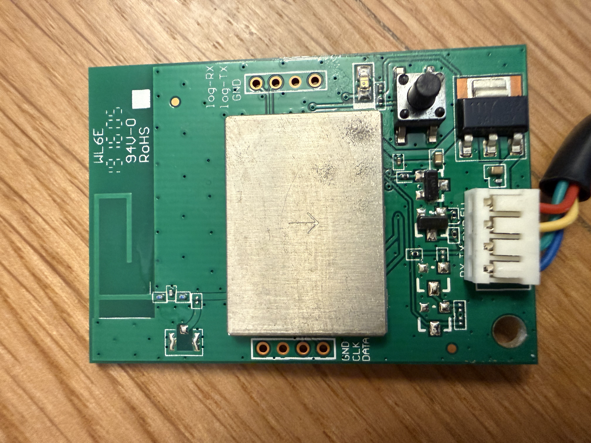
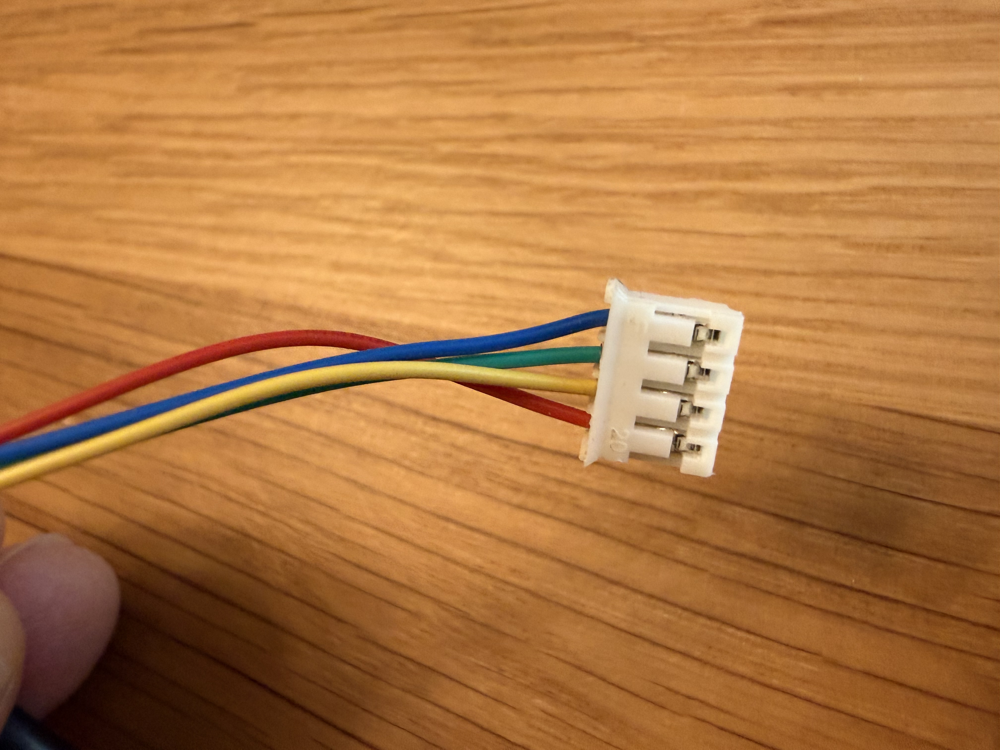
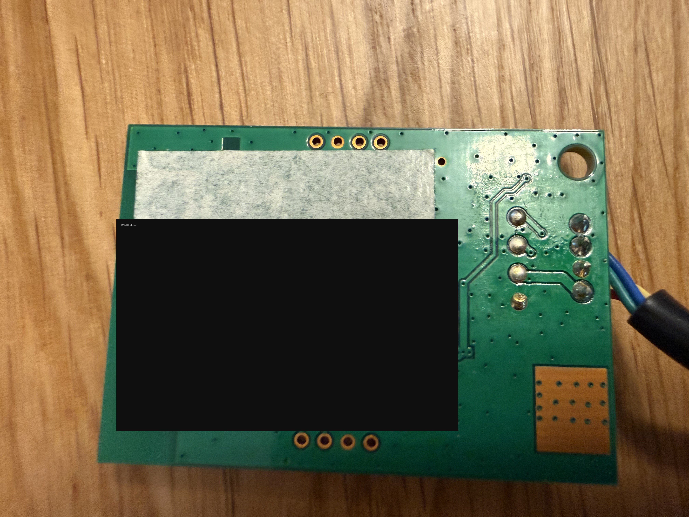

# 01 — Hardware & Firmware Identification

All data extracted from the UART boot log (115200 baud, 8N1) and from LAN discovery.

## Chip / SoC

| Parameter | Value | Source |
|---|---|---|
| SoC | **Realtek RTL8195A** (Ameba) | boot banner `<RTL8195A>ROM:[V0.1]` |
| ROM version | V0.1 | boot banner |
| XTAL | 40 MHz | `BOOT TYPE:0 XTAL:40000000` |
| Flash | external SPI (IMG1/IMG2/BOOTUSER images) | boot log |
| Reported `hw` | `rtl8710` | JSON status (`"hw":"rtl8710"`) |

> Note: the firmware reports `hw:rtl8710`, but the boot ROM clearly says `RTL8195A`.
> They belong to the same Ameba family; likely a shared build. Radio: **2.4 GHz only**.

## Firmware (Broadlink OEM)

| Parameter | Value |
|---|---|
| Platform | Broadlink OEM ("DNA") |
| Product Type | **20604** (0x507C) |
| `devtype` (LAN) | **0x507a** (= 20602) |
| Firmware version (`ver`) | **44026** |
| SVN | 3760 |
| Build time | 09:34:29 |
| Internal subsystem code | `TCLISO` (internal Broadlink name, NOT the TCL brand) |
| Application | broadlink Product Type 20604 |

## Device identity

| Parameter | Value |
|---|---|
| Device ID (`did`) | **`<your-did>`** |
| Product ID (`pid`) | `0000000000000000000000007c500000` |
| WiFi MAC | **`AA:BB:CC:DD:EE:FF`** |
| MAC (reversed endianness, as it appears in Broadlink) | `cb:9a:8f:42:f7:c8` |
| LAN IP (main network) | `192.168.1.10` |
| Local control port | `80` (UDP) |

## Cloud (EU region)

| Service | Endpoint |
|---|---|
| License activation | `20604service.ibroadlink.com` → `47.237.203.105` (`/devactiva/v2/devactiva`) |
| Heartbeat | `device-heartbeat-**deu**-a00df8b5.ibroadlink.com` |
| Cloud server (UDP) | `8.209.100.108` port `1812` / `5127` |

> The region is **deu (Germany/EU)**, even though the IPs are on Alibaba Cloud.

## Boot sequence (healthy)

```
<RTL8195A>ROM:[V0.1]  →  IMG1/IMG2/BOOTUSER load  →  license verify success
→  WIFI initialized  →  Application startup success
→  broadlink Product Type :20604 V44026 SVN: 3760
```

The only "error" in the boot is benign:
```
fota_head.magic=0xffffffff / fota_head.magic error!
```
It simply means the OTA area is empty (never-updated) — normal.

## Connector pinout (power / UART harness)

The 4‑wire JST harness on the module:

| Wire | Signal |
|---|---|
| Red | 5 V |
| Yellow | GND |
| Green / Blue | TX / RX (exact order to be confirmed) |

> ⚠️ The module is **5 V**, not 3.3 V — use a 5 V USB‑UART adapter.

The board also has a separate, silk‑screened **debug‑log UART header** labeled
`log-Rx` / `log-Tx` / `GND`. This is the console where the boot log — including the
`Aes PWd:` key line — is printed.

## Photos

| | |
|---|---|
|  |  |
| Module front: RF shield, `log-Rx/log-Tx/GND` header, JST harness | Close‑up of the debug‑log UART test points |
|  |  |
| Harness: red=5 V, yellow=GND, green/blue=TX/RX | Module back (MAC/SN redacted) |
